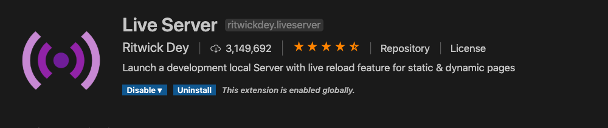

As mentioned in my previous post I'm using VS Code as my main editor. It turns out that it was a popular choice. Many of the coders that I follow have made the switch so it makes following their tutorials and example code videos a lot easier.  In this post I'll go over the installation on macOS, explain some of the choices I made in terms of extensions and discuss a few other configuration decisions I made. 

### Installation

You can either head over to the macOS section on the [Visual Studio Code website](https://code.visualstudio.com/docs/setup/mac) or you can download the latest version from [here](https://go.microsoft.com/fwlink/?LinkID=534106).

Once it's downloaded, double click the archive and drag the expanded app to your Applications folder. I usually launch the app from the command line but I also dragged the VS Code icon to my dock for quick access.

###The PATH of Enlightenment

If you use terminal a lot adding VS Code to your PATH variable is a no-brainer. You can run VS Code from the command line by typing `code` and then the name of the file you want to edit. You can also open a directory in VS Code by typing `code .` from within the folder like so:

```
~/my-dev-folder code .
```

To make thiinstalls magic happen you need to open the Command Palette (F1) and type 'shell command'. Select 'Shell Command: Install 'code' command in PATH' to add VS Code to your PATH. If you have a Terminal session running you will need to either restart your session or type:

```
source ~/.bashrc
```

This will reload your bash configuration and you can now launch VS Code from the command line by typing `code` followed by the file or directory name you would like to open, for example:

```
~/my-dev-folder code myComponent.js
```


### Why?

VS Code has macOS, Linux and Windows covered for one. It's also a performant, tightly integrated development environment that features a snappy source code editor with multi-language support. VS Code also sports syntax highlighting, bracket-matching, auto-indentation, box-selection, snippets, and a whole lot more. Other features include  IntelliSense code completion, effective code refactoring options and an integrated Terminal view that supports multiple sessions.

Debugging is also front and centre with Visual Studio Code. The interactive debugger let you step through code, inspect variables, view call stacks, and execute commands right from the console. Git support is also baked in so you can commit your work without leaving the app. 

### Extensions Galore

One of the many benefits of VS Code is the sheer number of handy extensions available. Here is a short list of must-have plugins (as of this writing!):

#### ES Lint

This is one of the most downloaded extensions for VS Code. [ESLint](https://marketplace.visualstudio.com/items?itemName=dbaeumer.vscode-eslint) integrates automatic formatting and linting with your editor. It is highly recommended.


#### Prettier

[Prettier](https://marketplace.visualstudio.com/items?itemName=esbenp.prettier-vscode) formats your code __consistently __ so you don’t have to sweat it. It does a great job and is very popular with over 7 million downloads.


#### Bracket Pair Colorizer

Identifying matching brackets in deeply nested code is a real pain. The [Bracket Pair Colorizer](https://marketplace.visualstudio.com/items?itemName=CoenraadS.bracket-pair-colorizer) extension correlates  brackets by identfying them with matching colors. Do yourself a favour and grab this one.


#### Debugger for Chrome

While console.log is handy for debugging the official [Debugger for Chrome](https://marketplace.visualstudio.com/items?itemName=msjsdiag.debugger-for-chrome) extension takes things to a whole new level, allowing you to use Chrome's debugger directly in VS Code.


####Live Server

The [Live Server](https://marketplace.visualstudio.com/items?itemName=ritwickdey.LiveServer) extension provides an easy to use development server with live reload for both static and dynamic pages. It's quick and easy to spin up a server when you need one directly from within VS Code.



####Path Intellisense

[Path Intellisense](https://marketplace.visualstudio.com/items?itemName=christian-kohler.path-intellisense) helps you automatically complete filenames while editing. Looking up path names for files or directories can be a real pain. This extension provides file and directory name intellisense completion which can save a lot of time and reduce the number of errors created by incorrect paths in your code.


### Themes Aplenty

Another benefit of VS Code's popularity is the abundance of themes available. The default installation comes with a fair number of themes available from Code > Preferences > Color Theme. You can also install other themes from VS Code's built-in Marketplace. My favorite theme of late is [Monokai++](https://marketplace.visualstudio.com/items?itemName=dcasella.monokai-plusplus). It's a dark but highly readable theme that works really well for me.


### Make it Your Own 

As previously mentioned there are loads of extensions and themes available for download on the VS Code Marketplace. Beyond that though there is a whole other realm of customization available to you by tweaking the parameters found in Code > Preferences > Settings. This includes all kinds of tweaks that are well beyond the scope of this post. There is also a comprehensive and customizable list of keyboard shortcuts which are especially welcome if you're coming from another editor and can't live with out the muscle memory :)

### In Conclusion 

VS Code's popularity, extensions and community support make it a worthwhile investment. The learning curve was minimal for me coming from Sublime Text and the added power of the extensions I use daily have made it a central part of my work flow.